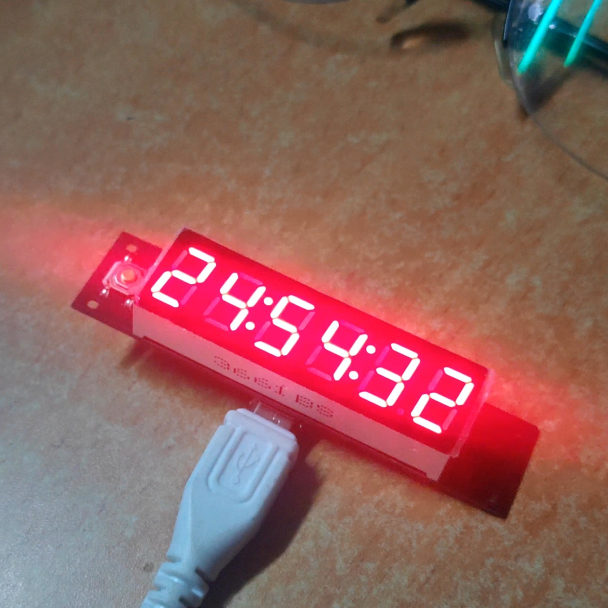

## 前言

再写已是2年后。

Get 25H A Day. 一天的时间划成25份，被倒数。

方案简单，硬件使用STM32F030F4做主控，6位LED数码管做显示，毫安级，未考虑到功率，故做成插电版。拟下一版采用6位LED数码管做显示，微安级。

印刷成品后，复位电路错误，飞线解决，造成不稳定。PCB工程已更正。

工具链使用STM32CubeMX创建工程，初始化代码；使用Source Insight做编辑；使用Keil4做编译和调试。

予成品两个，皆有遗憾之事。

[Github项目地址](https://github.com/tailor997/25H)

## 硬件设计

### 电路设计

- 3.3V稳压电路：AMS1117
- 供电、下载电路：Micro USB接口供电，SW下载口连接USB数据口。
- MCU:STM32F030F4
- 显示模块：6位LED数码管

### AD操作

#### 原理图

#### PCB图

- 线路性能要求不高，自动布线

## 软件设计

### 硬件初始化

- TIM
- GPIO

### 功能代码

- 定时器中断回调函数中，更新当前时间。
  - 25小时制的秒数需要计算，在优化代码后，一天误差几秒。

- 显示功能只有一个函数，选择位上显示数字 
  - 在主函数循环，动态扫描即可

```c
void NixieLightDisplay(uint8_t wei,uint8_t num);
```

## 成品




