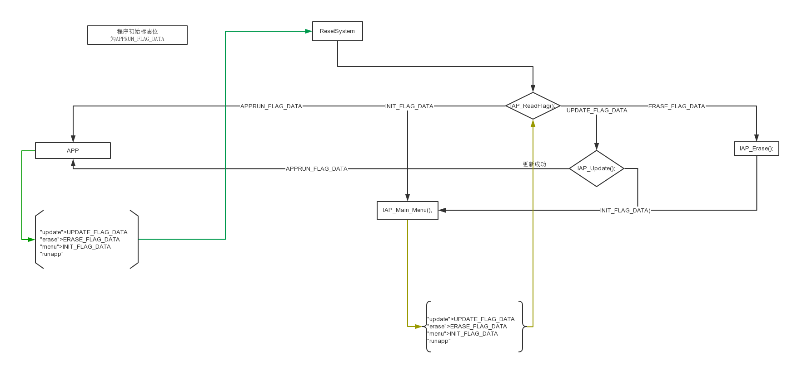
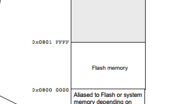
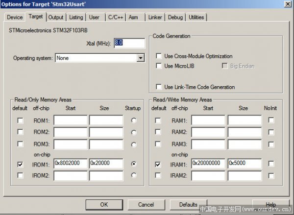

## 介绍

19年3月在三清公司实习时的操作。需要进行IAP方式升级固件。

在GitHub上的参考工程为STD库，减少工作量仅把Application部分移植为HAL库。

## 参考工程

参考工程分为3部分：

- [STM32 IAP(UART模式)的BOOT部分](https://github.com/havenxie/stm32-iap-uart-boot)
- [STM32 IAP(UART模式)的Application部分（USMART版）](https://github.com/havenxie/stm32-iap-uart-app)
- [winapp-iap-uart](https://github.com/havenxie/winapp-iap-uart)
  - STM32 IAP(UART模式)的上位机部分
  - 下载Application部分固件

## 原理

### 参考

pass

## 移植

### 软件结构总述

MCU:STM32F10C8T6

因BOOT,APP两个工程，使用全片擦除的烧录器需合并HEX文件。因HEX文件带地址信息，相较BIN文件更方便。

使用BKP寄存器保存BOOT与APP之间模式转换标志位（地址：IAP_FLAG_ADDR），并通过此标志位判断升级操作。



### BOOT软件结构

pass

### APP软件结构


####IAP.c

- IAP升级驱动文件

#### main.c

pass

### Flash

#### Flash使用分析

##### Memory mapping



| Flash大小                            | 64KB        | 128KB       |
| ------------------------------------ | ----------- | ----------- |
| Flash末端地址（始端皆为0X0800 0000） | 0X0800 FFFF | 0x0801 FFFF |
| Flash地址范围大小                    | 0X1 0000    | 0X2 0000    |


#### Flash配置



| 64KB        | Start起始地址 | Size   |
| ----------- | ------------- | ------ |
| BOOT        | 0x0800 0000   | 0x3000 |
| Application | 0x0800 3000   | 0XD000 |

#### 中断向量盘偏移

[参考-STM32IAP升级---编写IAP升级遇到的问题总结](http://www.51hei.com/bbs/dpj-43140-1.html)

- STD库

```C
void NVIC_Configuration(void)
{
	#ifdef  VECT_TAB_RAM
    /* Set the Vector Table base location at 0x20000000 */
    NVIC_SetVectorTable(NVIC_VectTab_RAM, 0x0);
	#else  /* VECT_TAB_FLASH  */
    /* Set the Vector Table base location at 0x08000000 */
    NVIC_SetVectorTable(NVIC_VectTab_FLASH, 0x0);
	#endif
}
```

## 下载固件

### JLINK下载BIN文件

pass

### 使用J-Flash制作合并烧写文件

pass

### [winapp-iap-uart](https://github.com/havenxie/winapp-iap-uart)更新固件

pass

