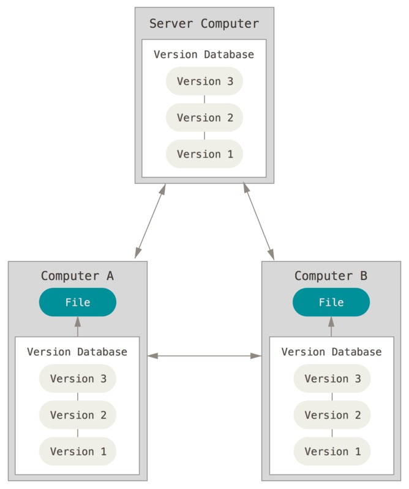

## 版本控制

版本控制是一种记录一个或若干文件内容变化，以便将来查阅特定版本修订情况的系统。

###### 参考

[起步 - 关于版本控制](https://git-scm.com/book/zh/v2/%E8%B5%B7%E6%AD%A5-%E5%85%B3%E4%BA%8E%E7%89%88%E6%9C%AC%E6%8E%A7%E5%88%B6)

### 集中化的版本控制系统

代表软件：SVN

有一个单一的集中管理的服务器，保存所有文件的修订版本，而协同工作的人们都通过客户端连到这台服务器，取出最新的文件或者提交更新。

如果宕机谁都无法提交更新，也就无法协同工作。 如果中心数据库所在的磁盘发生损坏，又没有做恰当备份，丢失所有数据——包括项目的整个变更历史，只剩下在各自机器上保留的单独快照。 

### 分布式版本控制系统

代表软件：Git

客户端并不只提取最新版本的文件快照， 而是把代码仓库完整地镜像下来，包括完整的历史记录。 这么一来，任何一处协同工作用的服务器发生故障，事后都可以用任何一个镜像出来的本地仓库恢复。 因为每一次的克隆操作，实际上都是一次对代码仓库的完整备份。

更进一步，许多这类系统都可以指定和若干不同的远端代码仓库进行交互。籍此，你就可以在同一个项目中，分别和不同工作小组的人相互协作。 你可以根据需要设定不同的协作流程，比如层次模型式的工作流，而这在以前的集中式系统中是无法实现的。

### SVN&Git比较

|              | Git    | SVN    |
| ------------ | ------ | ------ |
| 开发方式     | 分布式 | 集中式 |
| 内容存储方式 | 元数据 | 文件   |
| 全局版本号   | 无     | 有     |

## Git到GitHub的方式

### 比较

|         | GitHub Desktop | Github Web | Git Bash |
| ------- | -------------- | ---------- | -------- |
| 安装Git | 不需要         | 不需要     | 需要     |
|         |                |            |          |
|         |                |            |          |

### GitHub Desktop

[0基础的git教程，傻瓜都会用的Github Desktop](https://www.jianshu.com/p/06a960d991aa)

### 操作

- 登陆GitHub账号
  - File→Options→Accounts

- Clone Repository
- 把修改的文件复制到Clone Repository文件夹的对应位置
- Commit

### Git Bash

### Github Web

