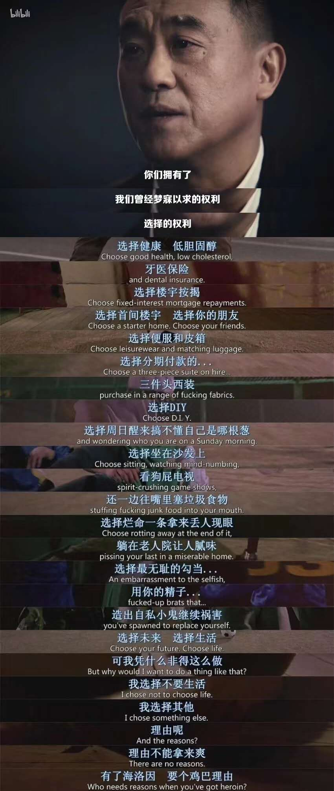
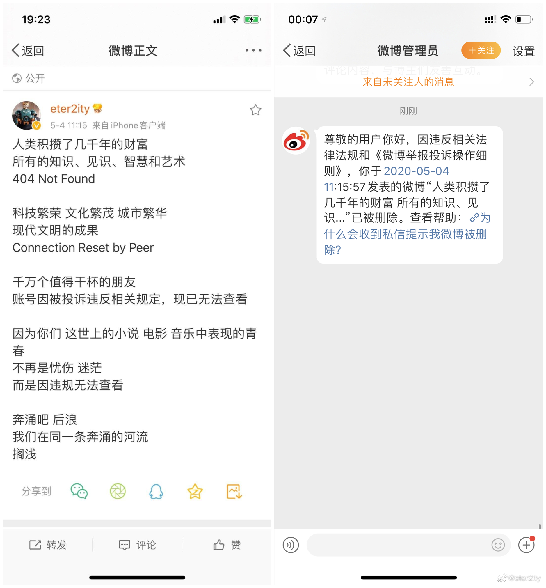

## 介绍

《后浪》本质是B站在五四青年节一商业广告，在舆论上多翻车，从消费主义、阶级差距上被声讨。

来自一张网图，转成视频版。

## 拼接

### 素材

- [bilibili献给新一代的演讲《后浪》](https://www.bilibili.com/video/BV1FV411d7u7)
- [《猜火车》](https://movie.douban.com/subject/1292528/)

### 成品

- 郑剪待剪中:-D

## 浪花

附一些因后浪而起的浪花：

- [播客-翻电 Special 去XXX年轻人的后浪 VOL.22](https://pca.st/episode/4a3cfb3d-1688-440a-989e-829fa969c51a)	

